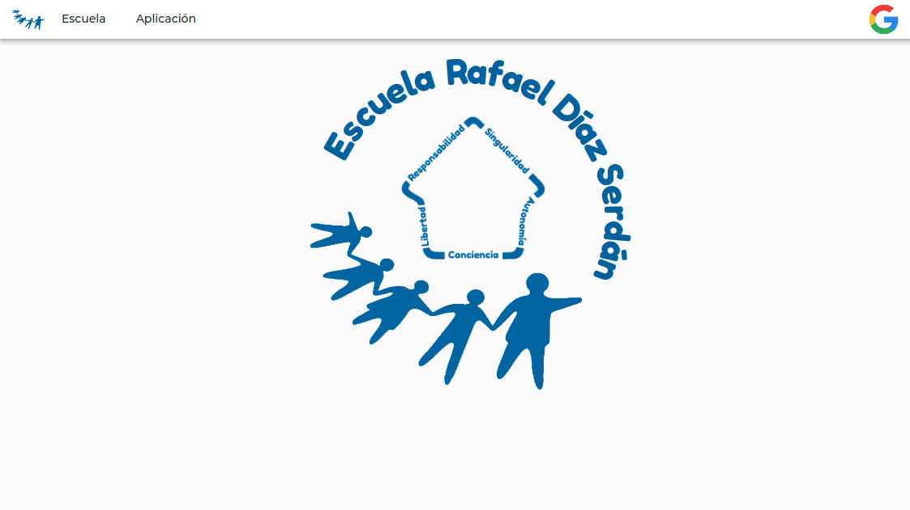
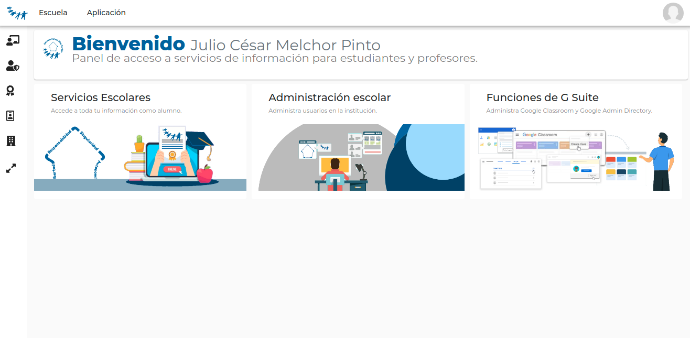
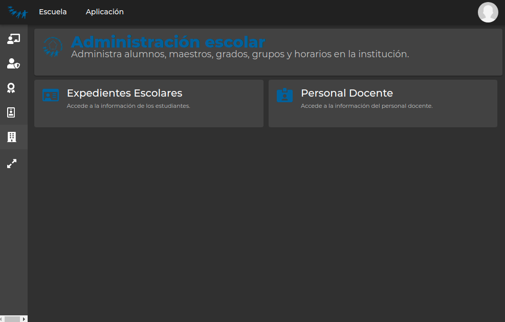

<h1> <a href="https://classroom-rds.web.app">
 
 </a> Classroom - RDS
 </h1>


Angular web app for a school admin in Google Classroom. Classroom entities adapted to fit "Escuela Rafael Díaz Serdan" requirements (Massive course's announcements, students and teachers block enrollment, manage groups and courses, view and edit information as an Admin and Superadmin in Google Workspace, and many more).

### Comming soon

Create school grades reports from Google Classroom submissions.

## Documentation and Demo

See Documentation for this project at: [Classroom RDS Doc](https://jcmelchorp.github.io/classroom-rds/).

See Demo app for this project at: [Classroom RDS](https://classroom-rds.web.app).

## Features

- Angular 12
- Angular Material 12 with custom theme and dark theme
- NGRX State Management 12 (@ngrx/route-store & @ngrx/data)
- Angular FontAwesome 5.15.1
- Angular Flex-layout 11
- Full Angular PWA 12
- Lasy Loading & SEO.
- Ngx-bootstrap 6.2.0 with Bootstrap 4.6.0
- Google API Auth2 (via GAPI with @types/gapi.auth2) & and Firebase Authentication
- Google Classroom Client (via GAPI with @types/gapi.client.classroom)
- Google Firebase for FireHosting
- Google Firebase Real-Time Database & Firestore
- CompoDoc for automated documentation.
- Angular PWA assets generator for icons.

## Screenshots



**Fig. 1** - View example



**Fig. 2** - View example



**Fig. 3** - View example
## Install this repository

If you want to use this repository as a template, run:

```` bash
git clone https://github.com/jcmelchorp/classroom-rds.git
````

then, enter the workspace directory:

```` bash
cd classroom-rds
````

and install NPM packages:

```` bash
npm install
````

## Build requirements

This repository has the following pre-requisites:

- [NodeJS](https://nodejs.org/)
- [Google Firebase](https://firebase.google.com/) Account (optional for Hosting and further features)
- [Angular CLI](https://cli.angular.io/)


The Angular CLI, CompoDoc, PWA asset generator comes with NPM install. If you want to use Angular CLI as a shell command:

```` bash
npm i -g @angular/cli
````

### Documentation

By default, this project generate documentation with Material Theme in *docs/* directory.

To generate documentation:

```` bash
 npm run doc:g
````

### Deployment

Build in production environment and deploy on Google Firebase

```` bash
npm run deploy
````

### Reset project to default

To reset project just type:

```` bash
npm run reset
````

### PWA Assets Generator

To generate Apple icons, MS-Tiles and splash run:

```` bash
npm run pwa:asset-std-logo
````
